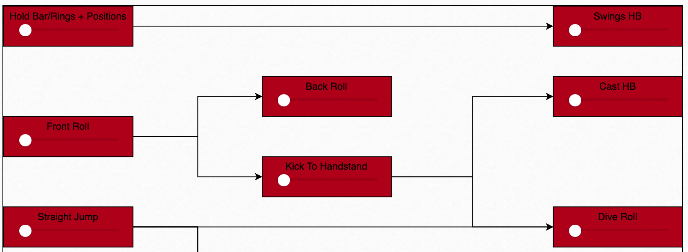

# Skill Tree of Gymnastics
A visual tool that can be used to plan and track your gymnastics progress.

## About The Project
When I was a gymnastics a few years ago, I always wanted a tech tree like civ v's or HOI4's but to track my athletes and motivate them. Now that I can program I've implemented it with my Lukas G.

## Built With
Rust as a language. Rocket with handlebars and sled as frameworks. Everything is served server side.

## Contact
Davide Radaelli - @daviderady - daviderady AT gmail DOT com
Project Link: https://github.com/MoreTacos/skilltree
